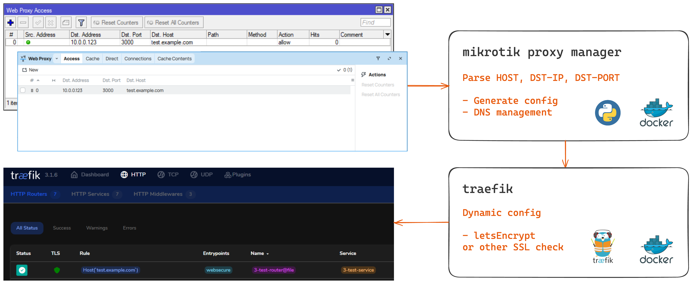
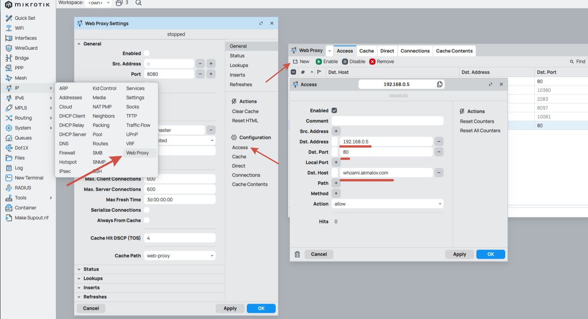
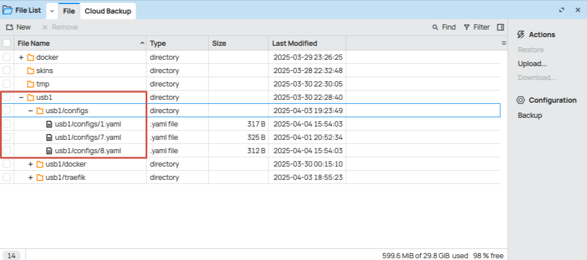

# MikroTik Proxy Manager

> **Gestión automatizada de proxy inverso a través de la interfaz de MikroTik**

> [!IMPORTANT]
> ### Elige la herramienta adecuada para la tarea
>
> | Si necesitas… | Usa |
> |---|---|
> | Un proxy inverso integrado simple | [Proxy inverso de MikroTik](https://help.mikrotik.com/docs/spaces/ROS/pages/377225232/Reverse+Proxy) (no se requiere software adicional) |
> | Traefik como proxy inverso | Ejecútalo en un host separado (VM o hardware dedicado) — es mucho más simple |
> | Una interfaz de gestión para proxy | [Nginx Proxy Manager](https://nginxproxymanager.com/) |
> | Te encanta Linux, contenedores, redes, depuración y sufrimiento | **Bienvenido a MikroTik Proxy Manager** 🔥 |

[](https://github.com/akmalovaa/mikrotik-proxy-manager)
[](LICENSE)

## 📋 Tabla de contenidos

- [Descripción](#description)
- [Arquitectura](#architecture)
- [Características](#features)
- [Requisitos](#requirements)
- [Inicio rápido (local)](#quick-start-local)
- [Configuración](#configuration)
- [Instalación y configuración](#installation--setup)
- [Uso](#usage)
- [Desarrollo](#development)
- [Seguridad](#security)

## 📖 Descripción

MikroTik Proxy Manager es una solución automatizada para administrar servidores proxy inversos a través de la interfaz de RouterOS de MikroTik. Agregar hosts mediante Winbox crea automáticamente la configuración dinámica de Traefik con soporte para certificados SSL de Let's Encrypt.

## 🏗️ Arquitectura



El sistema consta de dos contenedores que se ejecutan en [RouterOS Container](https://help.mikrotik.com/docs/display/ROS/Container):

- **Traefik** - Proxy inverso con gestión automática de SSL
- **MikroTik Proxy Manager** - Aplicación en Python para la sincronización de configuración

## ✨ Características

- 🔄 **Creación automática** de la configuración de Traefik
- 🌐 **Gestión de DNS** para hosts proxy
- 🔒 **Certificados SSL** mediante Let's Encrypt o certificados personalizados (incluye ejemplo de configuración de Cloudflare)
- 🖥️ **Gestión simple** a través de **Winbox**, **CLI** o **REST API**
- 📊 **Monitoreo** y registro de eventos (logging)

## 📋 Requisitos

- **RouterOS** con soporte para contenedores (arm64, x86)
- **Nombre de dominio**
- **Dirección IP pública** (opcional, requerida para Let's Encrypt)
- **Almacenamiento USB** o memoria interna para guardar la configuración (Recomendado para dispositivos MikroTik reales)
- **Habilidades**: Linux, Redes, MikroTik RouterOS, Depuración (Si lo configuraste y lo ejecutaste, felicidades, lo has hecho genial. Es mucho más fácil hacer esto en Linux que en RouterOS)

## ⚡ Inicio rápido (local)

¿Quieres probarlo sin tocar tu router? Ejecuta toda la pila localmente con Docker Compose contra un MikroTik existente:

```bash
cp .env.example .env
# edit .env: MIKROTIK_HOST, MIKROTIK_USER, MIKROTIK_PASSWORD, REVERSE_PROXY_IP
docker compose up --build
```

Esto inicia Traefik + `mikrotik-proxy-manager` juntos. MPM consultará `/ip/proxy/access` y escribirá las configuraciones dinámicas de Traefik en `./configs`, que Traefik monitorea en tiempo real.

## ⚙️ Configuración

Todos los ajustes son variables de entorno (cargadas mediante `pydantic-settings`, ver `.env.example`).

| Variable | Predeterminado | Descripción |
|---|---|---|
| `MIKROTIK_HOST` | — | IP / nombre de host de RouterOS |
| `MIKROTIK_USER` | — | Usuario de la API |
| `MIKROTIK_PASSWORD` | — | Contraseña de la API |
| `MIKROTIK_PORT` | `8728` | Puerto de la API de RouterOS (`8729` para TLS) |
| `MIKROTIK_USE_SSL` | `false` | Usar API-SSL |
| `MIKROTIK_DNS_MANAGER` | `true` | Administrar entradas de `/ip/dns/static` para hosts proxy |
| `REVERSE_PROXY_IP` | — | IP del contenedor Traefik: se usa como destino DNS A; vuelve a `MIKROTIK_HOST` si no se especifica |
| `TRAEFIK_CONFIGS_PATH` | `./configs` | Dónde MPM escribe los archivos YAML dinámicos (montado en `/srv/configs` dentro del contenedor) |
| `TLS_CERT_RESOLVER` | *(vacío)* | Resolvedor de certificados por router. Déjalo vacío para heredar desde `http.tls` a nivel de entryPoint (recomendado para configuraciones comodín). Si se establece, debe coincidir con un resolvedor definido en `traefik/traefik*.yml`. |
| `SYNC_INTERVAL_SECONDS` | `10` | Intervalo de consulta |
| `LOG_LEVEL` | `INFO` | Nivel de registro |
| `LOG_JSON` | `true` | Emitir registros JSON estructurados |

> **Importante**: Si `TLS_CERT_RESOLVER` está configurado, debe coincidir con un resolvedor realmente definido en la configuración estática de Traefik. El `traefik/traefik.yml` incluido define `letsEncrypt`; `traefik/traefik_cloudflare.yml` define `cloudflare`. Las incongruencias aparecerán como `Router uses a nonexistent certificate resolver` en los registros de Traefik.
>
> **Consejo para comodines**: para un único certificado `*.example.com` que cubra cada subdominio generado, deja `TLS_CERT_RESOLVER` vacío y declara el resolvedor + comodín en el entryPoint de tu `traefik.yml` estático:
>
> ```yaml
> entryPoints:
>   websecure:
>     address: :443
>     http:
>       tls:
>         certResolver: cloudflare
>         domains:
>           - main: example.com
>             sans:
>               - "*.example.com"
> ```
>
> Los routers generados emitirán `tls: {}` y heredarán este comodín automáticamente: no se realizarán solicitudes ACME por host.

## 🚀 Instalación y configuración

### Prerrequisitos

Antes de comenzar, prepara tu router MikroTik con soporte para contenedores y la configuración de API SSL. Sigue la [Guía de Contenedores de RouterOS](https://help.mikrotik.com/docs/display/ROS/Container) para obtener instrucciones detalladas.

Guía [simple](https://github.com/akmalovaa/mikrotik-proxy-manager/blob/main/mikrotik_guide.md)

> **Nota**: Esta configuración usa el desafío HTTP de Let's Encrypt (puerto 80) de forma predeterminada

### Paso 1: Preparar la estructura de directorios

Crea los directorios necesarios en tu dispositivo RouterOS:

> Si usas almacenamiento USB, verifica que el formato sea `EXT4`

```routeros
# Prepare config dir
/file/add type=directory name=usb1/configs
/file/add type=directory name=usb1/traefik
# Prepare container dir
/file/add type=directory name=usb1/docker/traefik
/file/add type=directory name=usb1/docker/mpm
```

### Paso 2: Descargar la configuración de Traefik

Descarga la configuración estática predeterminada de Traefik:

- https://raw.githubusercontent.com/akmalovaa/mikrotik-proxy-manager/refs/heads/main/traefik/traefik.yml

o el ejemplo de desafío DNS de Cloudflare:

- https://raw.githubusercontent.com/akmalovaa/mikrotik-proxy-manager/refs/heads/main/traefik/traefik_cloudflare.yml

Edita los ajustes (**establece un correo electrónico ACME real: Let's Encrypt rechaza las direcciones `example.com`**) y súbelo a los Archivos de MikroTik como `usb1/traefik/traefik.yml`.

Crea el archivo de almacenamiento ACME en `usb1/traefik/acme.json` (debe tener permisos `chmod 600` — ver [Problemas conocidos](#known-issues)).

### Paso 3: Configurar los puntos de montaje de contenedores

Configura los puntos de montaje para los contenedores:

```routeros
/container mounts
add dst=/srv/configs list=mpm_config src=/usb1/configs
add dst=/configs list=traefik_dynamic src=/usb1/configs
add dst=/etc/traefik list=traefik_static src=/usb1/traefik
```

### Paso 4: Configurar las variables de entorno

Configura las credenciales de la API para la conexión con MikroTik:

```routeros
/container envs
add key=MIKROTIK_HOST list=mpm value=192.168.88.1
add key=MIKROTIK_USER list=mpm value=user-api
add key=MIKROTIK_PASSWORD list=mpm value=password
# add key=REVERSE_PROXY_IP list=mpm value=10.0.0.1 # change Traefik container IP - defalut use MIKROTIK_HOST ip
# add key=TLS_CERT_RESOLVER list=mpm value=cloudflare # If you want to use Cloudflare DNS challenge - defalut empty
# add key=CF_DNS_API_TOKEN list=traefik value=YOUR_TOKEN
```

### Paso 5: Desplegar los contenedores

#### Desafío DNS de Cloudflare (Opcional)

Si deseas usar el desafío DNS de Cloudflare en lugar del HTTP:

<details>
<summary>Haz clic para expandir la configuración de Cloudflare</summary>

1. Usa la configuración de `traefik/traefik_cloudflare.yml`
2. Agrega tu token de API de Cloudflare:

```routeros
/container envs
add key=CF_DNS_API_TOKEN name=traefik value=your-cloudflare-api-token
add key=TLS_CERT_RESOLVER name=mpm value=cloudflare
```

# Deploy Traefik with environment variables

```routeros
/container add envlists=traefik interface=veth1 layer-dir="" logging=yes mountlists=traefik_static,traefik_dynamic name=traefik remote-image=mirror.gcr.io/traefik:v3.6.12 root-dir=/usb1/docker/traefik start-on-boot=yes workdir=/
```

</details>

#### Desplegar MikroTik Proxy Manager

```routeros
/container add envlists=mpm interface=veth1 layer-dir="" logging=yes mountlists=mpm_config name=mpm remote-image=ghcr.io/akmalovaa/mikrotik-proxy-manager:latest root-dir=usb1/docker/mpm start-on-boot=yes workdir=/srv
```

> Fija una etiqueta específica (p. ej., `:2.1.0`) para despliegues reproducibles en lugar de `:latest`.

### Paso 6: Iniciar los contenedores

Inicia tus contenedores y verifica que estén en ejecución:

```routeros
/container start [find name~"traefik"]
/container start [find name~"mpm"]
```

## 🎯 Uso

Una vez que los contenedores estén en ejecución, puedes administrar las configuraciones del proxy a través de múltiples métodos. El sistema monitorea las entradas de `/ip/proxy/access` y genera automáticamente las configuraciones de Traefik.

### Parámetros soportados

El sistema analiza actualmente estos parámetros de acceso proxy:

- **DST-HOST** - Nombre de host/dominio objetivo
- **DST-ADDRESS** - Dirección IP de destino  
- **DST-PORT** - Puerto de destino

### Método 1: Interfaz de Winbox

1. Abre Winbox y navega a **IP → Proxy → Access**
2. Agrega una nueva regla de acceso proxy con la configuración deseada



### Método 2: Consola de RouterOS

Agrega la configuración del proxy mediante CLI:

```routeros
/ip proxy access
add dst-host=test.example.com dst-address=192.168.88.10 dst-port=80
```

### Método 3: REST API

Agrega la configuración del proxy mediante la REST API de RouterOS:

```bash
curl -k -X PUT "https://192.168.88.1/rest/ip/proxy/access" \
    -u 'username:password' \
    -H "Content-Type: application/json" \
    -d '{"dst-address": "192.168.88.10", "dst-host": "test.example.com", "dst-port": "80"}'
```

### Verificar la configuración

Después de agregar las entradas proxy, puedes verificar las configuraciones generadas:

1. **Verifica los archivos de configuración generados**:
   

2. **Verifica los certificados SSL**:
   

3. **Monitorea los registros (logs) de los contenedores**:

   ```routeros
   /container log print
   ```

## 🛠️ Desarrollo

Este proyecto utiliza [`uv`](https://docs.astral.sh/uv/) para la gestión de dependencias (Python ≥ 3.13). `pyproject.toml` + `uv.lock` son la fuente de verdad: no uses `pip` / `venv` directamente.

### Desarrollo local en Python

```bash
# Install dependencies
uv sync

# Run the application locally (reads .env)
uv run python -m mikrotik_proxy_manager

# Lint + format
uv run ruff check
uv run ruff format

# Tests
uv run pytest
uv run pytest tests/test_sync.py::test_dst_host_change_removes_old_dns
```

### Desarrollo con Docker

```bash
# Full local stack (mpm + traefik)
docker compose up --build

# Dev compose variant
docker compose -f dev_compose.yaml up --build
```

### Pruebas con contenedores de RouterOS

Ejemplos de comandos para probar contenedores en RouterOS:

```routeros
# Deploy whoami test service
/container add remote-image=ghcr.io/traefik/whoami:latest interface=veth2 root-dir=/docker/whoami logging=yes

# Deploy NGINX for testing
/container add remote-image=mirror.gcr.io/nginx:latest interface=veth1 root-dir=usb1/docker/nginx logging=yes

# Python container for debugging
/container add remote-image=mirror.gcr.io/python:3.13.7-slim interface=veth1 root-dir=usb1/docker/python logging=yes cmd="tail -f /dev/null"
```

## 🔒 Seguridad

> **⚠️ ADVERTENCIA DE SEGURIDAD**
>
> **Ejecutar imágenes de contenedores de terceros en tu router puede representar riesgos de seguridad.**
>
> - Asegúrate de confiar en las imágenes de contenedor que despliegas
> - Actualiza regularmente los contenedores para parchear vulnerabilidades de seguridad  
> - Monitorea la actividad de los contenedores y el tráfico de red
> - Usa contraseñas seguras para el acceso a la API
> - Considera la segmentación de red para el tráfico de contenedores
>
> Si tu router se ve comprometido, los contenedores maliciosos podrían usarse para instalar software dañino en tu router y propagarse por tu red.

### Mejores prácticas de seguridad

1. **Usa credenciales API seguras** para el acceso a MikroTik
2. **Actualiza regularmente** las imágenes de los contenedores
3. **Monitorea los registros** en busca de actividad sospechosa
4. **Limita el acceso a la red de los contenedores** siempre que sea posible
5. **Usa reglas de firewall** para restringir la comunicación de los contenedores

## 📝 Tareas pendientes (TODO)

- [ ] Agregar características de seguridad de aplicaciones de Crowdsec
- [ ] Implementar validación de configuración
- [ ] Agregar panel de monitoreo
- [ ] Soporte para certificados SSL personalizados
- [ ] Registro y alertas mejorados

## 📄 Licencia

Este proyecto tiene licencia MIT - consulta el archivo [LICENSE](LICENSE) para obtener más detalles.

## 🤝 Contribuciones

¡Las contribuciones son bienvenidas! No dudes en enviar un Pull Request.

## 📞 Soporte

Si encuentras algún problema o tienes preguntas, por favor [abre un issue](https://github.com/akmalovaa/mikrotik-proxy-manager/issues) en GitHub.

## Problemas conocidos

### Permisos de ACME - Registros de Traefik

```log
traefik:: {"level":"error","error":"unable to get ACME account: permissions 644 for acme.json are too open, please use 600","resolver":"cloudflare","time":"2025-09-08T20:02:11Z","message":"The ACME resolve is skipped from the resolvers list"}
```

```routeros
container/print
container/shell number=X
chmod 600 acme.json
```

reinicia el contenedor

### Problemas de red en contenedores

Ejecuta el contenedor con `cmd="tail -f /dev/null"` y verifica la red dentro del contenedor

```routeros
container/print
container/shell number=X
ip addr show or cat /proc/net/route
```

Verifica la red de trabajo y cambia la configuración de tu RouterOS de `bridge` o `veth` o `ip address`

Un ejemplo de la documentación oficial:

> Crea una nueva interfaz veth y asigna una dirección IP en un rango que sea único en tu red:

```routeros
/interface/veth/add name=veth1 address=172.17.0.2/24 gateway=172.17.0.1
```
