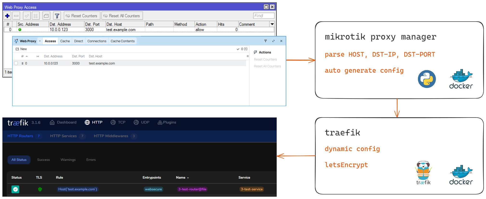

# mikrotik-proxy-manager

## Managing reverse proxy from winbox

Adding hosts in the winbox interface automatically creates a dynamic configuration for traefik



LetsEncrypt (httpChallenge) for auto obtain SSL certificates


Uses containers in [RouterOS](https://help.mikrotik.com/docs/display/ROS/Container):
- traefik
- mikrotik-proxy-manager (python app) 

**For the service to work, you need:**
- RouterOS with enabled container feature (arm64, x86)
- Public ip address
- Domain name


## Guide

### Prepare Router OS
RouterOS - https://help.mikrotik.com/docs/display/ROS/Container

Container package needs to be installed (enable container mode) 

> [!NOTE]  
> External disk is highly recommended (formatting USB on ext4)

### Prepare API SSL

Create certifcates
```routeros
/certificate
add name=CA-Template common-name=CAtemp key-usage=key-cert-sign,crl-sign
add name=Server common-name=server
add name=Client common-name=client
```

Certificates should be signed. 
**Change your RouterOS host address**
```routeros
/certificate
sign CA-Template
sign Client     
sign Server ca-crl-host=192.168.88.1 name=ServerCA
```

Enable API-SSL. **Change api access address**
```routeros
/ip service
set api-ssl address=192.168.88.0/24 certificate=ServerCA
```

Create group for only read API info + create a user for that group
```routeros
/user group
add name=api2 policy=local,read,write,api,rest-api,!telnet,!ssh,!ftp,!reboot,!policy,!test,!winbox,!password,!web,!sniff,!sensitive,!romon
/user add name=user-api group=api password=password
```

### RouterOS Files

necessary folders:
- usb1/configs (mount to python + traefik)
- usb1/traefik (mount static traefik config)

```routeros
file/add name=usb1 type=directory
file/add name=usb1/configs type=directory
```

Fetch static config traefik yaml
```routeros
file/add name=usb1 type=directory
file/add name=usb1/configs type=directory

/tool fetch url="https://raw.githubusercontent.com/akmalovaa/mikrotik-proxy-manager/refs/heads/main/traefik/traefik.yml" mode=https dst-path="usb1/traefik/traefik.yml"
```


### Network
Create separate bridge + ip address - **Change YOUR IP Addresses**
```routeros
/interface/bridge/add name=br-docker
/ip/address/add address=10.0.0.1/24 interface=br-docker
```
Create virtal interface
```routeros
/interface/veth/add name=veth1 address=10.0.0.10/24 gateway=10.0.0.1
/interface/bridge/port/add bridge=br-docker interface=veth1
```
NAT config
```routeros
/ip/firewall/nat/add chain=srcnat action=masquerade src-address=10.0.0.0/24
```

Firewall forward 80, 443 port to traefik proxy
```routeros
/ip firewall/nat/
add action=dst-nat chain=dstnat comment=http dst-port=80 protocol=tcp to-addresses=10.0.0.10 to-ports=80
add action=dst-nat chain=dstnat comment=https dst-port=443 protocol=tcp to-addresses=10.0.0.10 to-ports=44
```

### Contaier settings

Registry
- docker.io
- mirror.gcr.io (docker mirror)
- ghcr.io (github registry)

use the appropriate registry by writing the full name of the container path

`mirror.gcr.io` + `traefik:3.3.4`   reuslt: `mirror.gcr.io/traefik:3.3.4`


**mount points**

```routeros
/container mounts
add name=traefik_static src=/usb1/traefik dst=/etc/traefik
add name=traefik_dynamic src=/usb1/configs dst=/configs
add name=mpm_config src=/usb1/configs dst=/srv/configs
```

**environments**

API user password
```
/container envs
add key=MIKROTIK_HOST name=mpm value=192.168.88.1
add key=MIKROTIK_USER name=mpm value=user-api
add key=MIKROTIK_PASSWORD name=mpm value=password
```


**traefik**
```routeros
/container/add remote-image=mirror.gcr.io/traefik:3.3.4 interface=veth1 root-dir=usb1/docker/traefik mounts=traefik_static,traefik_dynamic start-on-boot=yes logging=yes
```

**mikrotik-proxy-manager**
```routeros
/container/add remote-image=ghcr.io/akmalovaa/mikrotik-proxy-manager:latest envlist=mpm interface=veth1 root-dir=usb1/docker/mpm mounts=mpm_config logging=yes start-on-boot=yes
```

Run containers 

Use winbox `/ip/proxy/access` for create proxy config

At the current time, it works very simply, parse only:
- HOST
- DST-IP
- DST-PORT


### Dev 

python
```
uv sync
uv run python -m mikrotik_proxy_manager
```

debug container:
```
ghcr.io/traefik/whoami
```

example commands:
```shell
# whoami
/container/add remote-image=ghcr.io/traefik/whoami:latest interface=veth2 root-dir=/docker/whoami logging=yes

# NGINX
/container/add remote-image=mirror.gcr.io/nginx:latest interface=veth1 root-dir=usb1/docker/nginx logging=yes

# python image for debug and shell exec
/container/add remote-image=mirror.gcr.io/python:3.13.2-slim interface=veth1 root-dir=usb1/docker/python logging=yes cmd="tail -f /dev/null"
```

> [!IMPORTANT] 
> **RouterOS bags v7.16:**
> 1. If change ram-high `/container config set ram-high=200`, container logs will be lost, ram-high must be = 0
> 2. There is no way to passthrough a specific volume one file, only the entire directory
>

> [!WARNING]  
> **Security risks:**
> 
> Running an obscure container image on your router can open a security breach
> 
> If the router is hacked, the containers can be used to easily install malicious software on your router and over the network

TO DO:
- fix build armv7 github action
- mb add authelia authentication and authorization server
- mb add crowdsec AppSec feature
