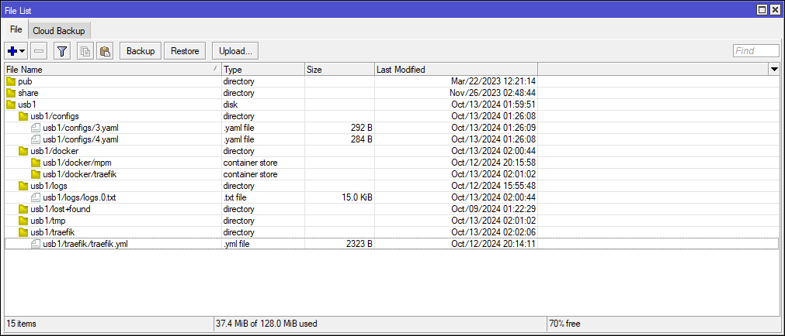
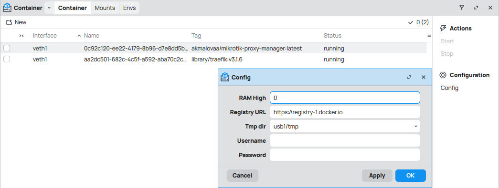

# mikrotik-proxy-manager

## Managing reverse proxy from winbox

Adding hosts in the winbox interface automatically creates a dynamic configuration for traefik


Obtaining SSL certificates via letsEncrypt or wildcard certs Clouflare API


Uses containers in [RouterOS](https://help.mikrotik.com/docs/display/ROS/Container):
- traefik
- mikrotik-proxy-manager (python app) 

**For the service to work, you need:**
- RouterOS with enabled container feature (arm64, x86)
- Public ip address
- Domain name

> An easier way to use a reverse proxy server without a public IP [Cloudflare Tunnel](https://developers.cloudflare.com/cloudflare-one/connections/connect-networks/) (Only for cloudflare DNS provider)

## Guide

### Prepare
RouterOS Container package needs to be installed (enable container mode) 

Install container mode - https://help.mikrotik.com/docs/display/ROS/Container

> [!NOTE]  
> External disk is highly recommended (formatting USB on ext4)

Copy the configuration to your device
```shell
git clone https://github.com/akmalovaa/mikrotik-proxy-manager.git 
```
dragging and dropping or SMB, NFS, SFTP copy-past


necessary folders:
- configs
- traefik
- logs

### Network
Create separate bridge + ip address 
```routeros
/interface/bridge/add name=br-docker
/ip/address/add address=10.0.0.1/24 interface=br-docker
```
Create virtal interface
```routeros
/interface/veth/add name=veth1 address=10.0.0.10/24 gateway=10.0.0.1
/interface/bridge/port/add bridge=br-docker interface=veth1
```
NAT config
```routeros
/ip/firewall/nat/add chain=srcnat action=masquerade src-address=10.0.0.10/24
```

Firewall forward 80, 443 port to traefik proxy
```routeros
/ip firewall/nat/
add action=dst-nat chain=dstnat comment=http dst-port=80 protocol=tcp to-addresses=10.0.0.10 to-ports=80
add action=dst-nat chain=dstnat comment=https dst-port=443 protocol=tcp to-addresses=10.0.0.10 to-ports=44
```

### Logging

write logs to file, `usb1/logs/logs.0.txt`
```routeros
/system logging action
add disk-file-count=1 disk-file-name=usb1/logs/logs disk-lines-per-file=100 name=logfile target=disk
/system logging
add action=logfile topics=system,info
```


### Contaier settings



**base config docker-hub registry**
```routeros
/container config
set registry-url=https://registry-1.docker.io tmpdir=usb1/tmp
```

github registry - `https://ghcr.io`

**mount points**
```routeros
/container mounts
add name=traefik_static src=/usb1/traefik dst=/etc/traefik
add name=traefik_dynamic src=/usb1/configs dst=/configs
add name=mpm_logs src=/usb1/logs dst=/srv/logs
add name=mpm_config src=/usb1/configs dst=/srv/configs
```

**traefik**
```routeros
/container/add remote-image=traefik:v3.1.6 interface=veth1 root-dir=usb1/docker/traefik mounts=traefik_static,traefik_dynamic start-on-boot=yes logging=yes
```

**mikrotik-proxy-manager**
```routeros
/container/add remote-image=akmalovaa/mikrotik-proxy-manager interface=veth1 root-dir=usb1/docker/mpm mounts=mpm_logs,mpm_config logging=yes start-on-boot=yes
```

Run containers 

Use winbox `/ip/proxy/access` for create proxy config

At the current time, it works very simply, parse only:
- HOST
- DST-IP
- DST-PORT


### Dev 

python
```
uv sync
uv run python -m mikrotik_proxy_manager
```


example commands:
```shell
# whoami
/container/add remote-image=ghcr.io/traefik/whoami:latest interface=veth1 root-dir=/docker/whoami logging=yes

# NGINX
/container/add remote-image=nginx:latest interface=veth1 root-dir=usb1/docker/nginx logging=yes

# python image for debug and shell exec
/container/add remote-image=python:3.12.7-slim interface=veth1 root-dir=usb1/docker/python logging=yes cmd="tail -f /dev/null"
```

> [!IMPORTANT] 
> **RouterOS bags v7.16:**
> 1. If change ram-high `/container config set ram-high=200`, container logs will be lost, ram-high must be = 0
> 2. There is no way to passthrough a specific volume one file, only the entire directory
>

> [!WARNING]  
> **Security risks:**
> 
> Running an obscure container image on your router can open a security breach
> 
> If the router is hacked, the containers can be used to easily install malicious software on your router and over the network

TO DO:
- fix build armv7 github action
- mb add authelia authentication and authorization server
- mb add crowdsec AppSec feature