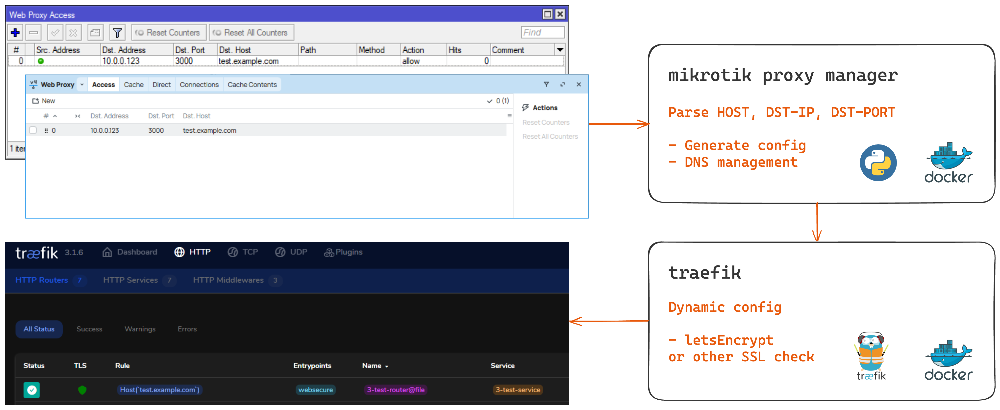
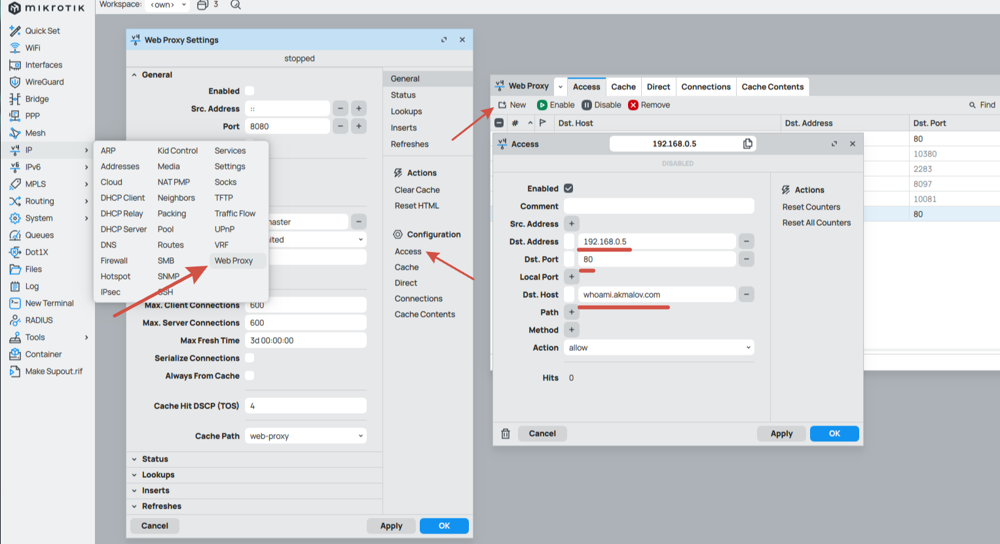
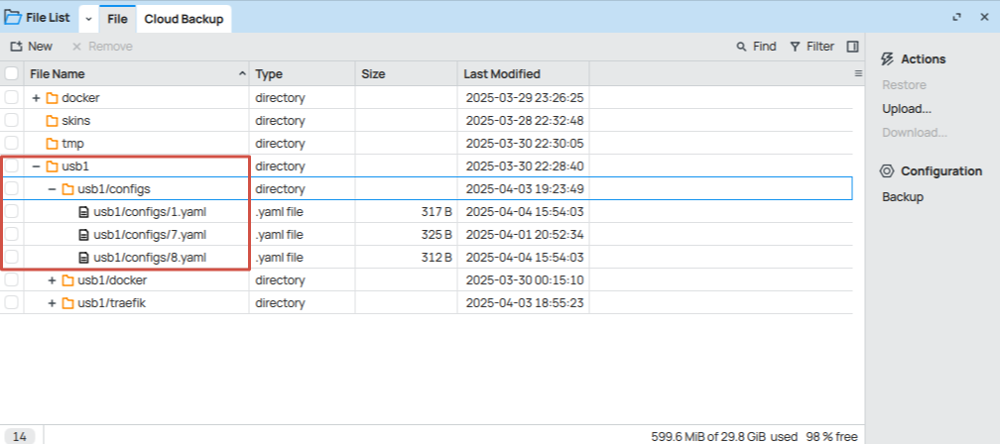

# MikroTik Proxy Manager

> **Automated reverse proxy management through MikroTik interface**

[](https://github.com/akmalovaa/mikrotik-proxy-manager)
[](LICENSE)

## 📋 Table of Contents

- [Description](#description)
- [Architecture](#architecture)
- [Features](#features)
- [Requirements](#requirements)
- [Installation & Setup](#installation--setup)
- [Usage](#usage)
- [Development](#development)
- [Security](#security)

## 📖 Description

MikroTik Proxy Manager is an automated solution for managing reverse proxy servers through the MikroTik RouterOS interface. Adding hosts via Winbox automatically creates dynamic Traefik configuration with Let's Encrypt SSL certificate support.

## 🏗️ Architecture



The system consists of two containers running in [RouterOS Container](https://help.mikrotik.com/docs/display/ROS/Container):

- **Traefik** - Reverse proxy with automatic SSL management
- **MikroTik Proxy Manager** - Python application for configuration synchronization

## ✨ Features

- 🔄 **Automatic creation** of Traefik configuration
- 🌐 **DNS management** for proxy hosts
- 🔒 **SSL certificates** via Let's Encrypt or custom certificates (including Cloudflare configuration example)
- 🖥️ **Simple management** through **Winbox**, **CLI**, or **REST API**
- 📊 **Monitoring** and logging

## 📋 Requirements

- **RouterOS** with container support (arm64, x86)
- **Domain name**
- **Public IP address** (optional, required for Let's Encrypt)
- **USB storage** or internal memory for configuration storage (Recommended for real mikrotik devices)

## 🚀 Installation & Setup

### Prerequisites

Before starting, prepare your MikroTik router with container support and API SSL settings. Follow the [RouterOS Container Guide](https://help.mikrotik.com/docs/display/ROS/Container) for detailed instructions.

Simple [guide](https://github.com/akmalovaa/mikrotik-proxy-manager/blob/main/mikrotik_guide.md)

> **Note**: This setup uses Let's Encrypt HTTP Challenge (port 80) by default

### Step 1: Prepare Directory Structure

Create necessary directories on your RouterOS device:

```routeros
/file add name=usb1 type=directory
/file add name=usb1/configs type=directory
/file add name=usb1/traefik type=directory
```

### Step 2: Download Traefik Configuration

Fetch the static Traefik default configuration:

```routeros
/tool fetch url="https://raw.githubusercontent.com/akmalovaa/mikrotik-proxy-manager/refs/heads/main/traefik/traefik.yml" mode=https dst-path="usb1/traefik/traefik.yml"
```

### Step 3: Configure Container Mounts

Set up mount points for containers:

```routeros
/container mounts
add name=traefik_static src=/usb1/traefik dst=/etc/traefik
add name=traefik_dynamic src=/usb1/configs dst=/configs  
add name=mpm_config src=/usb1/configs dst=/srv/configs
```

### Step 4: Configure Environment Variables

Set up API credentials for MikroTik connection:

```routeros
/container envs
add key=MIKROTIK_HOST name=mpm value=192.168.88.1
add key=MIKROTIK_USER name=mpm value=user-api
add key=MIKROTIK_PASSWORD name=mpm value=password
```

### Step 5: Deploy Containers

#### Deploy Traefik

```routeros
/container add remote-image=mirror.gcr.io/traefik:3.3.4 interface=veth1 root-dir=usb1/docker/traefik mounts=traefik_static,traefik_dynamic start-on-boot=yes logging=yes
```

#### Cloudflare DNS Challenge (Optional)

If you want to use Cloudflare DNS challenge instead of HTTP challenge:

<details>
<summary>Click to expand Cloudflare configuration</summary>

1. Use the configuration from `traefik/traefik_cloudflare.yml`
2. Add your Cloudflare API token:

```routeros
/container envs
add key=CF_DNS_API_TOKEN name=traefik value=your-cloudflare-api-token

# Deploy Traefik with environment variables
/container add remote-image=mirror.gcr.io/traefik:v3.5.1 envlist=traefik interface=veth1 root-dir=usb1/docker/traefik mounts=traefik_static,traefik_dynamic start-on-boot=yes logging=yes
```

</details>

#### Deploy MikroTik Proxy Manager

```routeros
/container add remote-image=ghcr.io/akmalovaa/mikrotik-proxy-manager:latest envlist=mpm interface=veth1 root-dir=usb1/docker/mpm mounts=mpm_config logging=yes start-on-boot=yes
```

### Step 6: Start Containers

Start your containers and verify they're running:

```routeros
/container start [find name~"traefik"]
/container start [find name~"mpm"]
```

## 🎯 Usage

Once the containers are running, you can manage proxy configurations through multiple methods. The system monitors `/ip/proxy/access` entries and automatically generates Traefik configurations.

### Supported Parameters

The system currently parses these proxy access parameters:

- **DST-HOST** - Target hostname/domain
- **DST-ADDRESS** - Destination IP address  
- **DST-PORT** - Destination port

### Method 1: Winbox Interface

1. Open Winbox and navigate to **IP → Proxy → Access**
2. Add a new proxy access rule with your desired configuration



### Method 2: RouterOS Console

Add proxy configuration via CLI:

```routeros
/ip proxy access
add dst-host=test.example.com dst-address=192.168.88.10 dst-port=80
```

### Method 3: REST API

Add proxy configuration via RouterOS REST API:

```bash
curl -k -X PUT "https://192.168.88.1/rest/ip/proxy/access" \
    -u 'username:password' \
    -H "Content-Type: application/json" \
    -d '{"dst-address": "192.168.88.10", "dst-host": "test.example.com", "dst-port": "80"}'
```

### Verify Configuration

After adding proxy entries, you can verify the generated configurations:

1. **Check generated config files**:
   

2. **Verify SSL certificates**:
   

3. **Monitor container logs**:

   ```routeros
   /container log print
   ```

## 🛠️ Development

### Local Python Development

Set up the development environment:

```bash
# Install dependencies
uv sync

# Run the application locally
uv run python -m mikrotik_proxy_manager
```

### Docker Development

For development with Docker containers:

```bash
# Build and run development containers
docker-compose -f dev_compose.yaml up --build
```

### Testing with RouterOS Containers

Example commands for testing containers in RouterOS:

```routeros
# Deploy whoami test service
/container add remote-image=ghcr.io/traefik/whoami:latest interface=veth2 root-dir=/docker/whoami logging=yes

# Deploy NGINX for testing
/container add remote-image=mirror.gcr.io/nginx:latest interface=veth1 root-dir=usb1/docker/nginx logging=yes

# Python container for debugging
/container add remote-image=mirror.gcr.io/python:3.13.7-slim interface=veth1 root-dir=usb1/docker/python logging=yes cmd="tail -f /dev/null"
```

## 🔒 Security

> **⚠️ SECURITY WARNING**
>
> **Running third-party container images on your router can pose security risks.**
>
> - Ensure you trust the container images you deploy
> - Regularly update containers to patch security vulnerabilities  
> - Monitor container activity and network traffic
> - Use strong passwords for API access
> - Consider network segmentation for container traffic
>
> If your router is compromised, malicious containers could be used to install harmful software on your router and spread across your network.

### Security Best Practices

1. **Use strong API credentials** for MikroTik access
2. **Regularly update** container images
3. **Monitor logs** for suspicious activity
4. **Limit container network access** where possible
5. **Use firewall rules** to restrict container communication

## 📝 TODO

- [ ] Add Crowdsec application security features
- [ ] Implement configuration validation
- [ ] Add monitoring dashboard
- [ ] Support for custom SSL certificates
- [ ] Enhanced logging and alerting

## 📄 License

This project is licensed under the MIT License - see the [LICENSE](LICENSE) file for details.

## 🤝 Contributing

Contributions are welcome! Please feel free to submit a Pull Request.

## 📞 Support

If you encounter any issues or have questions, please [open an issue](https://github.com/akmalovaa/mikrotik-proxy-manager/issues) on GitHub.
